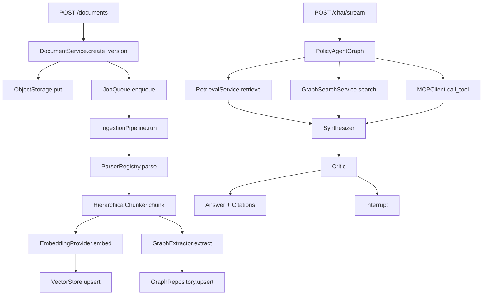

# PolicyMind 开发手册

版本：1.0

日期：2026-07-01

适用仓库：`D:\project`

本文档是 PolicyMind 的编码接口契约，回答“每个模块怎么实现、重要函数叫什么、输入输出是什么”。产品范围以根目录的设计文档为准，开发顺序以实施计划为准；若目录示例冲突，以本手册采用的 `backend/src/policymind` 布局为准。

## 1. 文档关系

| 文档 | 作用 |
|---|---|
| `docs/policymind/2026-07-01-policymind-design.md` | 产品范围、完整架构、数据模型、验收指标 |
| `docs/policymind/2026-07-01-policymind-implementation.md` | TDD任务顺序、阶段提交与验收 |
| `docs/policymind/DEVELOPMENT_GUIDE.md` | 模块接口、关键函数、调用链、编码规范 |

## 2. 核心目标

系统必须形成三条真实闭环：

1. 上传制度文件 → 解析 → 分块 → 向量索引/图谱索引 → 可查询。
2. 用户提问 → 路由 → RAG/GraphRAG/MCP → 合成 → 校验 → 带引用回答。
3. 低置信度或写操作 → LangGraph中断 → 人工决定 → 原线程恢复。

禁止出现以下“假完成”：

- 配置了Milvus但运行时仍固定使用内存列表。
- MCP Client直接调用同进程函数。
- `pending_review=True`但没有真正中断和恢复。
- 上传接口只返回Chunk预览，没有写入知识库。
- Critic无条件返回通过。
- Embedding失败时返回零向量。

## 3. 技术栈

### 3.1 后端

| 技术 | 用途 |
|---|---|
| Python 3.12 | 唯一支持的后端运行版本 |
| FastAPI | HTTP API、依赖注入、SSE入口 |
| Pydantic 2 | 配置、请求响应、领域边界校验 |
| SQLAlchemy 2 | PostgreSQL ORM和Repository |
| Alembic | 数据库版本迁移 |
| LangChain | 模型与消息抽象 |
| LangGraph | Agent状态机、循环、Checkpoint、HITL |
| ARQ + Redis | 文档异步摄取任务 |
| OpenTelemetry | Trace和Span |
| Prometheus Client | 指标暴露 |

### 3.2 数据与AI

| 技术 | 用途 |
|---|---|
| PostgreSQL | 用户、租户、文档版本、Chunk元数据、会话、审计 |
| Milvus | Dense向量、BM25 Sparse向量、混合检索 |
| Neo4j | 制度、部门、岗位、流程、审批关系 |
| MinIO/S3 | 原始文档和图片 |
| PyMuPDF | PDF文本、页码和bbox |
| python-docx | Word段落和表格 |
| openpyxl | Excel工作表 |
| PaddleOCR | 扫描件与截图OCR |
| OpenAI-compatible LLM | 路由、抽取、规划、生成和校验 |
| FastMCP | 独立MCP Server |

### 3.3 前端与测试

- Vue3、TypeScript、Vite、Pinia、Vue Router。
- DOMPurify清洗Markdown HTML。
- Cytoscape.js展示答案相关子图。
- pytest、pytest-asyncio、pytest-cov、Ruff、mypy。
- Vitest、Vue Test Utils、Playwright。

## 4. 开发环境

### 4.1 后端启动

```powershell
cd D:\project\backend
uv sync --all-extras
uv run alembic upgrade head
uv run uvicorn policymind.main:app --reload
```

不得使用 `python app/main.py` 或修改 `sys.path`。Python包的唯一导入根是：

```python
from policymind.core.config import get_settings
```

### 4.2 前端启动

```powershell
cd D:\project\frontend
npm ci
npm run dev
```

### 4.3 基础设施

Docker不是强制要求。三种方式等价：

1. `deploy/compose.infrastructure.yml`启动依赖。
2. 本机安装PostgreSQL、Redis、Milvus、Neo4j和MinIO。
3. `.env`配置云端/远程服务地址。

单元测试不得依赖Docker；集成测试通过`integration` marker显式运行。

## 5. 总体调用关系



## 6. 通用上下文与领域类型

### 6.1 RequestContext

所有业务入口必须接收上下文，不允许从全局变量猜测租户：

```python
from dataclasses import dataclass

@dataclass(frozen=True, slots=True)
class RequestContext:
    tenant_id: int
    user_id: int
    access_level: int
    role: str
    trace_id: str
```

### 6.2 文档类型

```python
class DocumentBlock(BaseModel):
    text: str
    page_number: int
    block_type: Literal["title", "text", "table", "image", "flowchart"]
    heading_path: tuple[str, ...] = ()
    bbox: tuple[float, float, float, float] | None = None
    media_key: str | None = None


class ParsedDocument(BaseModel):
    title: str
    page_count: int
    blocks: list[DocumentBlock]
    metadata: dict[str, JsonValue]


class Chunk(BaseModel):
    id: str
    tenant_id: int
    document_id: int
    document_version_id: int
    parent_id: str | None
    level: Literal["parent", "leaf"]
    text: str
    page_number: int
    heading_path: tuple[str, ...]
    bbox: tuple[float, float, float, float] | None
    access_level: int
    effective_from: datetime
    effective_to: datetime | None
```

Chunk ID必须稳定，同一文档版本重新处理得到相同ID：

```text
sha256(document_version_id + page + bbox + normalized_text)
```

### 6.3 检索类型

```python
class SearchHit(BaseModel):
    chunk: Chunk
    score: float
    channel: Literal["dense", "bm25", "graph"]
    rank: int


class Citation(BaseModel):
    id: str
    document_name: str
    document_version: str
    page_number: int
    quote: str
    bbox: tuple[float, float, float, float] | None
    channel: str
    score: float


class RetrievalBundle(BaseModel):
    query: str
    hits: list[SearchHit]
    citations: list[Citation]
    context: str
    trace: RetrievalTrace
```

## 7. Core模块

路径：`backend/src/policymind/core`

### 7.1 配置

重要函数：

```python
@lru_cache
def get_settings() -> Settings:
    """读取并校验环境配置；测试通过依赖注入覆盖，不修改全局环境。"""


def validate_production_settings(settings: Settings) -> None:
    """拒绝默认JWT、弱密码、通配CORS和缺失依赖URL。"""
```

关键规则：

- `.env`必须进入`.gitignore`。
- `.env.example`只能放占位值。
- 生产环境不允许`JWT_SECRET=change-me`。
- CORS使用列表，不能对带Credentials的请求配置`*`。
- 不在模块导入时连接数据库或模型服务。

### 7.2 错误

```python
class PolicyMindError(Exception):
    code: str
    status_code: int
    public_message: str


class InvalidDocument(PolicyMindError): ...
class DependencyUnavailable(PolicyMindError): ...
class AuthorizationDenied(PolicyMindError): ...
class EmbeddingUnavailable(PolicyMindError): ...
class ApprovalRequired(PolicyMindError): ...
class AgentBudgetExceeded(PolicyMindError): ...
```

FastAPI异常处理器只返回公开信息和`trace_id`，完整堆栈进入日志。

### 7.3 应用工厂

```python
def create_app(
    settings: Settings | None = None,
    container: ServiceContainer | None = None,
) -> FastAPI:
    """创建应用；测试传入内存适配器，生产由配置创建真实适配器。"""
```

- `/health/live`只判断进程存活。
- `/health/ready`检查当前配置声明为必需的依赖。
- 启动时不调用`metadata.create_all()`，只使用Alembic。

## 8. Auth模块

路径：`backend/src/policymind/auth`

### 8.1 重要函数

```python
def hash_password(password: SecretStr) -> str:
    """Argon2id哈希。"""


def verify_password(password: SecretStr, password_hash: str) -> bool:
    """常量时间校验密码。"""


class AuthService:
    def register(self, invitation_token: str, username: str, password: SecretStr) -> User: ...
    def authenticate(self, tenant_slug: str, username: str, password: SecretStr) -> TokenPair: ...
    def refresh(self, refresh_token: str) -> TokenPair: ...
    def revoke(self, refresh_token: str) -> None: ...
```

### 8.2 认证依赖

```python
async def get_current_context(
    credentials: HTTPAuthorizationCredentials,
    users: UserRepository,
) -> RequestContext:
    """解析JWT后再次查询用户，验证租户、启用状态、角色和Token版本。"""


def require_roles(*roles: UserRole) -> Callable[..., RequestContext]:
    """FastAPI RBAC依赖。"""
```

禁止用户通过注册请求自行指定`tenant_id`或管理员角色。

## 9. Documents模块

路径：`backend/src/policymind/documents`

### 9.1 上传校验

```python
def validate_upload(
    filename: str,
    declared_mime: str,
    content: bytes,
    max_bytes: int,
) -> ValidatedUpload:
    """同时验证扩展名、MIME、文件魔数、大小和空文件。"""


def safe_storage_key(tenant_id: int, suffix: str) -> str:
    """生成tenant/uuid形式的对象Key，不拼接原始文件名。"""
```

Office文件必须进一步检查ZIP内部结构，不能只看到`PK`就认定合法。

### 9.2 对象存储

```python
class ObjectStorage(Protocol):
    async def put(self, key: str, content: bytes, content_type: str) -> None: ...
    async def get(self, key: str) -> bytes: ...
    async def delete(self, key: str) -> None: ...
```

实现：

- `LocalObjectStorage`：本机开发和单元测试。
- `S3ObjectStorage`：MinIO/S3。

### 9.3 文档服务

```python
class DocumentService:
    async def create_version(
        self,
        context: RequestContext,
        command: CreateDocumentVersion,
    ) -> IngestionReceipt:
        """校验→哈希幂等→保存对象→写DB→提交任务→返回202信息。"""

    async def soft_delete(self, context: RequestContext, document_id: int) -> None:
        """标记删除并提交向量/图谱补偿清理任务。"""
```

### 9.4 Parser

```python
class DocumentParser(Protocol):
    supported_mime_types: frozenset[str]
    def parse(self, content: bytes, filename: str) -> ParsedDocument: ...


class ParserRegistry:
    def register(self, parser: DocumentParser) -> None: ...
    def resolve(self, mime_type: str) -> DocumentParser: ...
    def parse(self, upload: ValidatedUpload) -> ParsedDocument: ...
```

解析器不得直接写数据库、向量库或对象存储。

### 9.5 分块

```python
class HierarchicalChunker:
    def chunk(
        self,
        document: ParsedDocument,
        context: ChunkContext,
    ) -> list[Chunk]:
        """构造Parent和Leaf；表头、标题、页码、bbox和来源不得丢失。"""
```

## 10. Ingestion Pipeline

### 10.1 状态机

```text
QUEUED
  → STORED
  → PARSED
  → CHUNKED
  → EMBEDDED
  → VECTOR_INDEXED
  → GRAPH_INDEXED
  → READY
```

失败状态记录`failed_stage`、异常类别和重试次数。

### 10.2 重要函数

```python
class IngestionPipeline:
    async def run(self, version_id: int) -> IngestionResult:
        """从DB状态继续执行，已完成阶段不重复产生副作用。"""

    async def resume(self, job_id: int) -> IngestionResult:
        """只重试失败阶段及其后续阶段。"""


async def ingest_document_job(ctx: dict[str, object], version_id: int) -> dict[str, object]:
    """ARQ入口；只解析参数和调用Pipeline。"""
```

Pipeline跨PostgreSQL、Milvus、Neo4j时不做分布式事务，以幂等写入和补偿任务保证最终一致。

## 11. Retrieval模块

路径：`backend/src/policymind/retrieval`

### 11.1 Embedding

```python
class EmbeddingProvider(Protocol):
    dimension: int
    model_name: str
    async def embed_documents(self, texts: Sequence[str]) -> list[list[float]]: ...
    async def embed_query(self, text: str) -> list[float]: ...
```

返回数量、维度和有限浮点数必须校验。失败直接抛出`EmbeddingUnavailable`。

### 11.2 VectorStore

```python
class VectorStore(Protocol):
    async def upsert(self, chunks: Sequence[Chunk], vectors: Sequence[list[float]]) -> None: ...

    async def hybrid_search(
        self,
        *,
        query_text: str,
        query_vector: list[float],
        tenant_id: int,
        access_level: int,
        at: datetime,
        limit_per_channel: int,
    ) -> HybridCandidates: ...

    async def delete_document_version(self, tenant_id: int, version_id: int) -> int: ...
```

安全参数不得设置默认值，调用方必须显式传入。

### 11.3 RRF

```python
def rrf_fuse(
    channels: Mapping[str, Sequence[SearchHit]],
    weights: Mapping[str, float],
    *,
    k: int = 60,
    limit: int = 30,
) -> list[SearchHit]:
    """按chunk_id去重并融合排名，不直接比较不同渠道的原始分数。"""
```

公式：

```text
score(d) = Σ weight(channel) / (k + rank(channel, d))
```

### 11.4 Rerank

```python
class Reranker(Protocol):
    async def rerank(
        self,
        query: str,
        candidates: Sequence[SearchHit],
        limit: int,
    ) -> list[SearchHit]: ...
```

使用批量Rerank API；超时后原样返回RRF顺序并在Trace标记降级。禁止对30个Chunk逐条调用聊天模型。

### 11.5 RetrievalService

```python
class RetrievalService:
    async def retrieve(
        self,
        context: RequestContext,
        query: str,
        *,
        at: datetime,
        top_k: int = 8,
    ) -> RetrievalBundle:
        """Embedding→Dense/BM25→RRF→Rerank→Parent扩展→Citation。"""
```

### 11.6 Citation

```python
def build_citations(hits: Sequence[SearchHit]) -> list[Citation]: ...


def validate_answer_citations(
    answer: str,
    citations: Sequence[Citation],
) -> CitationValidation:
    """找出缺失、未知和未使用的Citation ID。"""
```

## 12. GraphRAG模块

路径：`backend/src/policymind/graph`

### 12.1 Ontology

实体：

- Policy、Clause、Department、Role、Process、ApprovalStep、Requirement、Form。

关系：

- APPLIES_TO、OWNED_BY、REQUIRES、APPROVED_BY、NEXT_STEP、REFERENCES、SUPERSEDES、CONFLICTS_WITH、EXTRACTED_FROM。

### 12.2 Regex JSON提取

```python
def extract_json_object(text: str) -> dict[str, JsonValue]:
    """优先JSON代码块，再以平衡括号扫描提取首个完整对象。"""


async def parse_llm_json(
    text: str,
    schema: type[T],
    repair: Callable[[str, str], Awaitable[str]],
) -> T:
    """Regex提取→json.loads→Pydantic；失败时进行一次真实格式修复。"""
```

不能对同一个错误字符串重复解析并称为“重试”。

### 12.3 图谱抽取

```python
class GraphExtractor:
    async def extract(self, chunk: Chunk) -> GraphExtraction:
        """抽取并校验实体关系；无来源或端点不存在的关系直接拒绝。"""
```

### 12.4 GraphRepository

```python
class GraphRepository(Protocol):
    async def upsert(self, extraction: GraphExtraction) -> None: ...

    async def search_paths(
        self,
        *,
        tenant_id: int,
        seed_entity_ids: Sequence[str],
        max_hops: int,
        limit: int,
    ) -> list[GraphPath]: ...
```

Cypher必须在查询入口限定`tenant_id`，不能查出后再用Python过滤。

### 12.5 GraphSearchService

```python
class GraphSearchService:
    async def search(
        self,
        context: RequestContext,
        query: str,
        seed_hits: Sequence[SearchHit],
        max_hops: int,
    ) -> GraphSearchResult:
        """Chunk→种子实体→路径→评分→带关系/来源的上下文。"""
```

## 13. MCP模块

路径：`backend/src/policymind/mcp`

### 13.1 工具

```python
async def get_employee_profile(employee_id: str, context: ToolContext) -> EmployeeProfile: ...
async def get_approval_chain(request: ApprovalQuery, context: ToolContext) -> ApprovalChain: ...
async def list_required_materials(process_type: str, context: ToolContext) -> Materials: ...
async def get_policy_version(policy_name: str, at: date, context: ToolContext) -> PolicyVersion: ...
async def create_review_ticket(command: ReviewTicketCommand, context: ToolContext) -> ReviewTicket: ...
```

前三类业务数据可以使用项目内演示数据，但必须经过Repository，不得写死在工具函数中。

### 13.2 MCP Client

```python
class EnterpriseMCPClient:
    async def connect(self) -> None: ...
    async def list_tools(self) -> list[MCPTool]: ...
    async def call_tool(
        self,
        name: str,
        arguments: dict[str, JsonValue],
        context: ToolContext,
        approval: ApprovalToken | None = None,
    ) -> ToolObservation: ...
```

必须通过MCP Transport调用独立Server，禁止直接import工具函数。

### 13.3 写操作

`create_review_ticket`执行前要求：

- LangGraph已经触发HITL。
- Approval Token由后端签发、单次有效、绑定thread/tool/arguments hash。
- Idempotency Key防止恢复节点时重复创建。

## 14. Agent模块

路径：`backend/src/policymind/agents`

### 14.1 AgentState

```python
class AgentState(TypedDict):
    messages: Annotated[list[BaseMessage], add_messages]
    request_context: dict[str, JsonValue]
    thread_id: str
    user_query: str
    normalized_query: str
    route: str
    route_reason: str
    plan: list[dict[str, JsonValue]]
    current_step_id: str | None
    completed_step_ids: list[str]
    observations: list[dict[str, JsonValue]]
    retrieval_ref: str | None
    graph_ref: str | None
    citation_ids: list[str]
    draft_answer: str
    critique: dict[str, JsonValue] | None
    retry_count: int
    tool_call_count: int
    step_budget: int
    token_budget: int
    pending_review_id: int | None
    errors: list[str]
```

Checkpoint只存结果引用和摘要，不存整份Chunk正文。

### 14.2 节点函数

```python
async def normalize_node(state: AgentState) -> dict[str, object]: ...
async def supervisor_node(state: AgentState) -> dict[str, object]: ...
async def retrieval_node(state: AgentState) -> dict[str, object]: ...
async def graph_node(state: AgentState) -> dict[str, object]: ...
async def planner_node(state: AgentState) -> dict[str, object]: ...
async def executor_node(state: AgentState) -> Command: ...
async def synthesizer_node(state: AgentState) -> dict[str, object]: ...
async def critic_node(state: AgentState) -> dict[str, object]: ...
async def replan_node(state: AgentState) -> dict[str, object]: ...
async def approval_node(state: AgentState) -> Command: ...
```

### 14.3 图构建

```python
def build_policy_graph(
    services: AgentServices,
    checkpointer: BaseCheckpointSaver,
) -> CompiledStateGraph:
    """构建并校验完整拓扑。"""
```

固定拓扑：

```text
START → normalize → supervisor
supervisor → retrieval | graph | planner | executor
planner → executor
executor → executor | planner | synthesizer
retrieval → synthesizer
graph → synthesizer
synthesizer → critic
critic → END | replan | approval
replan → planner
approval → executor | END
```

### 14.4 ReAct约束

- 单请求最多10次Tool Call。
- 单步骤最多2次失败重试。
- Planner最多5步，必须是DAG。
- 不向前端输出隐藏思维链。
- 对外只发送Plan、Action、Tool、Observation摘要和最终回答。

### 14.5 Critic

Critic检查：

- 每项重要结论是否有Citation或Tool Observation。
- 引用是否存在且支持结论。
- 文档版本是否在查询日期有效。
- 是否遗漏条件/例外。
- 是否越权。
- 是否需要拒答或HITL。

解析失败不能默认通过，应降低置信度或进入人工审核。

## 15. Conversations与HITL

### 15.1 ChatService

```python
class ChatService:
    async def invoke(
        self,
        context: RequestContext,
        command: ChatCommand,
    ) -> ChatResult: ...

    async def stream(
        self,
        context: RequestContext,
        command: ChatCommand,
    ) -> AsyncIterator[PublicAgentEvent]: ...

    async def resume(
        self,
        context: RequestContext,
        thread_id: str,
        decision: ReviewDecision,
    ) -> AsyncIterator[PublicAgentEvent]: ...
```

SSE只能来自显式`PublicAgentEvent`，不能监听并转发所有`on_chat_model_stream`。

### 15.2 HITL

```python
review = interrupt({
    "review_id": review_id,
    "reason": reason,
    "tool": tool_name,
    "arguments_summary": safe_summary,
})
```

恢复：

```python
await graph.ainvoke(
    Command(resume={"decision": "approve", "review_id": review_id}),
    config={"configurable": {"thread_id": thread_id}},
)
```

同一节点恢复时可能重新执行中断前代码，因此中断前不得产生非幂等副作用。

## 16. API契约

统一前缀：`/api/v1`

### 16.1 Auth

- `POST /auth/login`
- `POST /auth/refresh`
- `POST /auth/logout`
- `GET /auth/me`

### 16.2 Documents

- `POST /documents` → 202 + job ID。
- `GET /documents`
- `GET /documents/{id}`
- `GET /documents/{id}/versions`
- `POST /documents/{id}/versions`
- `GET /documents/jobs/{job_id}`
- `POST /documents/{id}/reprocess`
- `DELETE /documents/{id}`

### 16.3 Chat

- `POST /chat`
- `POST /chat/stream`
- `POST /chat/{thread_id}/resume`
- `GET /conversations`
- `GET /conversations/{id}`
- `DELETE /conversations/{id}`

公开SSE类型：

```text
routing, plan, tool_call, tool_result, retrieval,
graph_path, content, citation, review_required, error, done
```

### 16.4 Review、Graph、Evaluation

按设计文档实现，所有资源查询先同时匹配资源ID与当前`tenant_id`。

## 17. 前端

### 17.1 状态

```typescript
interface ChatState {
  threadId: string
  messages: ChatMessage[]
  timeline: PublicAgentEvent[]
  citations: Citation[]
  graphPaths: GraphPath[]
  pendingReview?: ReviewRequest
  streaming: boolean
}
```

### 17.2 SSE

```typescript
async function streamChat(
  command: ChatCommand,
  signal: AbortSignal,
  onEvent: (event: PublicAgentEvent) => void,
): Promise<void>
```

使用`fetch` POST读取ReadableStream。不能同时创建EventSource。

### 17.3 Markdown

```typescript
function renderSafeMarkdown(source: string): string {
  return DOMPurify.sanitize(marked.parse(source) as string)
}
```

Citation原文优先以纯文本渲染。

## 18. Evaluation

### 18.1 Golden Case

```python
class GoldenCase(BaseModel):
    id: str
    category: str
    question: str
    required_facts: list[str]
    expected_document_versions: list[str]
    expected_pages: list[int]
    expected_route: str
    expected_tools: list[str]
    expected_graph_edges: list[str]
    should_refuse: bool
```

### 18.2 指标函数

```python
def recall_at_k(retrieved: Sequence[str], relevant: set[str], k: int) -> float: ...
def reciprocal_rank(retrieved: Sequence[str], relevant: set[str]) -> float: ...
def ndcg_at_k(retrieved: Sequence[str], gains: Mapping[str, float], k: int) -> float: ...
def citation_precision(answer_ids: set[str], valid_ids: set[str]) -> float: ...
def graph_path_accuracy(actual: Sequence[str], expected: Sequence[str]) -> float: ...
def required_fact_coverage(answer: str, facts: Sequence[str]) -> float: ...
```

不能以“出现任意一个关键词”作为整题正确。

### 18.3 Runner

```python
class EvaluationRunner:
    async def prepare_corpus(self, dataset: DatasetVersion) -> CorpusVersion: ...
    async def run_case(self, case: GoldenCase, variant: EvaluationVariant) -> CaseResult: ...
    async def run(self, dataset: DatasetVersion) -> EvaluationReport: ...
```

评测必须先创建隔离Corpus，记录代码、数据、Prompt和模型版本。

## 19. 测试策略

### 19.1 单元测试

- 不联网、不使用Docker、不消费LLM额度。
- 使用Fake LLM、Memory Repository和Inline Job Runner。
- 覆盖纯逻辑、失败和权限边界。

### 19.2 Contract Test

内存与生产适配器运行同一组测试：

```python
@pytest.mark.parametrize("store", ["memory", "milvus"])
async def test_vector_store_contract(store, ...): ...
```

### 19.3 集成测试

使用`@pytest.mark.integration`，验证PostgreSQL、Milvus、Neo4j、Redis、MinIO和MCP Transport。

### 19.4 E2E

必须覆盖：

1. 上传文件后可问答。
2. 多租户不可互相检索。
3. GraphRAG返回带关系和来源的路径。
4. Plan-and-Execute完成全部步骤。
5. 写工具中断，批准后只执行一次。
6. 无依据时拒答。

## 20. 安全清单

- `.env`不提交。
- 上传检查文件魔数和Office ZIP结构。
- 原始文件名不作为路径。
- PostgreSQL、Milvus、Neo4j均在查询入口过滤租户。
- 检索文档视为不可信数据，不接受其中的指令。
- LLM生成的Markdown必须清洗。
- JWT解析后重新查询用户。
- MCP工具Server端再次鉴权。
- 写操作需要Approval Token和Idempotency Key。
- 日志不记录Token、密码、完整PII和完整文档。

## 21. 错误与降级

| 故障 | 行为 |
|---|---|
| Milvus不可用 | 返回503，不允许LLM凭常识回答制度 |
| Neo4j不可用 | 降级Hybrid RAG并明确标记 |
| Rerank不可用 | 保留RRF顺序并记录Trace |
| VLM不可用 | 保留OCR结果 |
| MCP只读工具不可用 | 返回缺失信息或进入HITL |
| MCP写工具未批准 | 必须interrupt |
| Supervisor解析失败 | 默认Hybrid RAG |
| Critic解析失败 | 低置信度或HITL，不能默认通过 |

禁止`except Exception: pass`。系统边界可以捕获宽泛异常，但必须记录并转成领域错误。

## 22. Git与开发流程

每个行为使用：

```text
RED：写测试并确认因目标行为缺失而失败
GREEN：写最小实现并确认测试通过
REFACTOR：清理结构并保持全绿
COMMIT：一个阶段一个清晰提交
```

提交格式：

```text
chore: 工程和工具
feat: 新功能
fix: 缺陷
test: 测试和数据集
docs: 文档
refactor: 不改变行为的重构
```

提交前：

```powershell
cd D:\project\backend
uv run ruff check src tests
uv run mypy src
uv run pytest -m "not integration"

cd D:\project\frontend
npm run typecheck
npm test -- --run
```

## 23. Definition of Done

一个模块只有同时满足以下条件才算完成：

- 真实调用链已接通，不是固定数据或空适配器。
- 单元测试先失败后通过。
- 生产适配器有Contract/Integration Test。
- 租户和权限测试通过。
- 错误与降级行为可观察。
- API/类型文档与代码一致。
- Ruff、mypy、pytest或前端门禁全部通过。
- 已提交独立Git commit。

整个项目完成还必须达到设计文档中的评测阈值，并能重复演示“上传→问答→引用”“GraphRAG路径”“MCP写操作HITL”三条主线。
